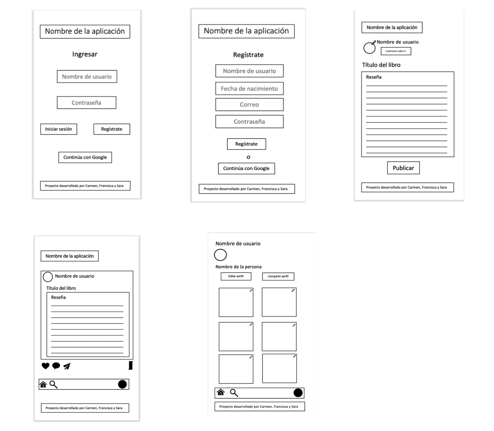
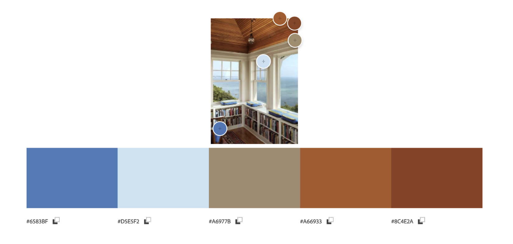
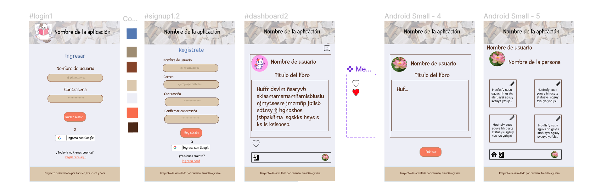
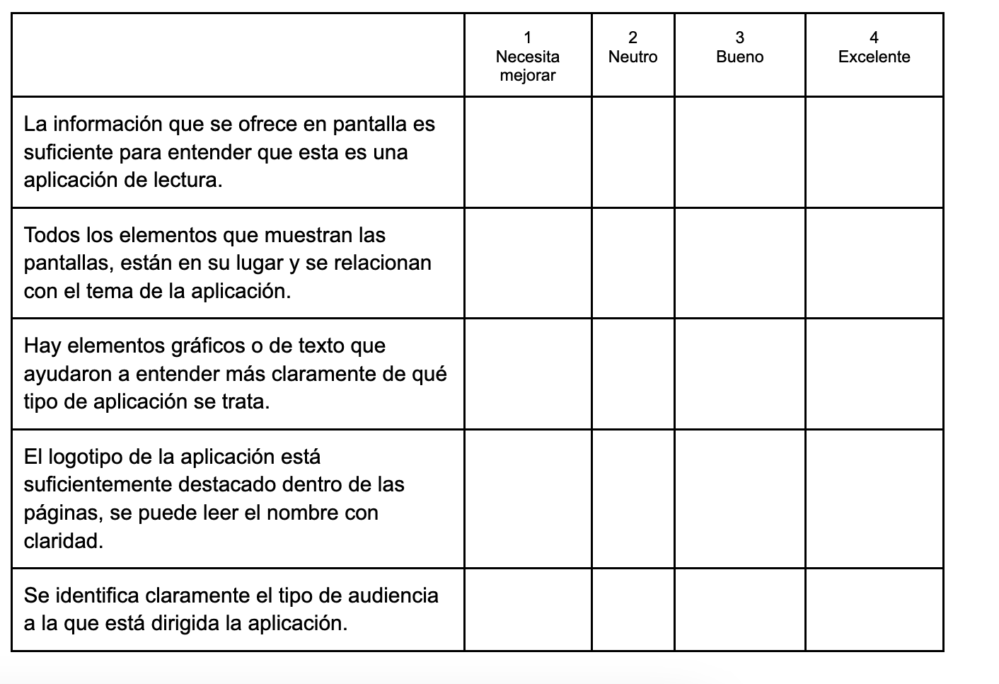
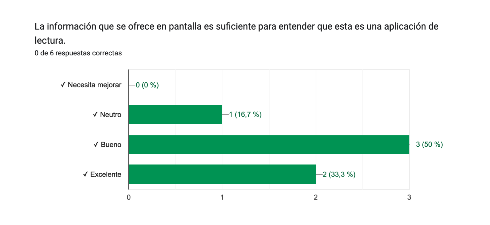
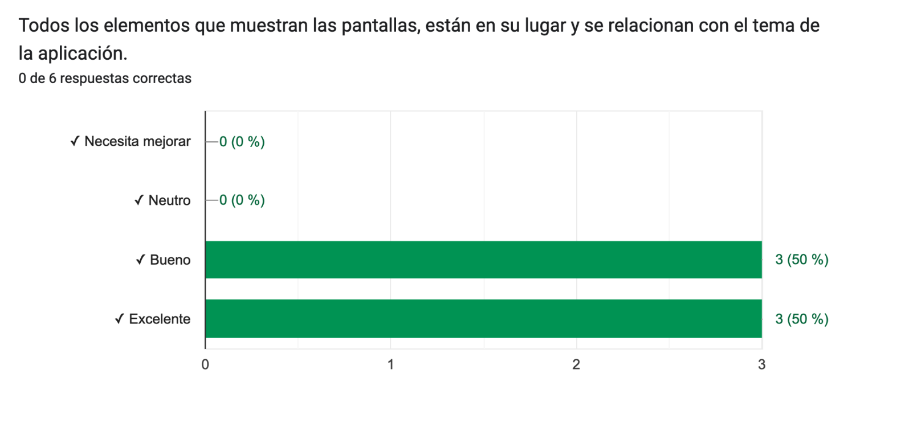
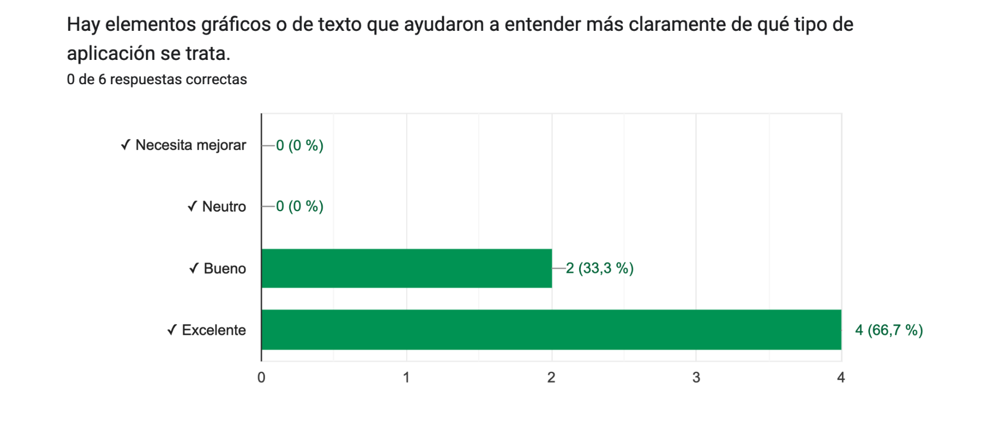
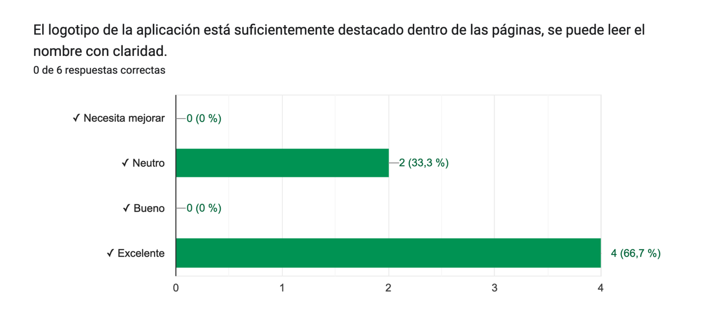
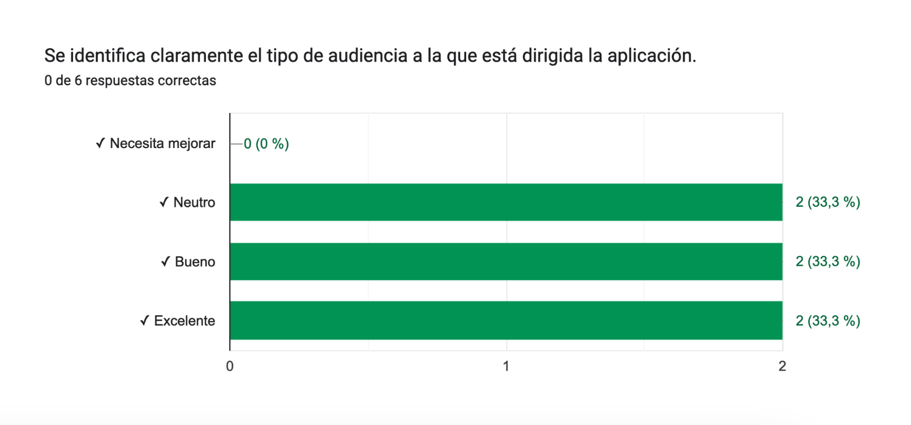

# Creando una Red Social

## Purrfect Books

Muchas personas disfrutan de la lectura de libros, pero esa afición puede ser solitaria si no se es parte de una comunidad que comparta el gusto por la lectura. Entre las personas que aman los libros hay un grupo que desea poder interactuar con otros lectores,conocer las opiniones que otros tienen sobre los libros que están leyendo, y conocer nuevos títulos a partir de las lecturas de otras personas.

## Hallazgos

Para entender mejor qué información podrían necesitar nuestros usuarios, hicimos una rápida investigación (research) y estos son algunos de los hallazgos.
[Cada año se publican aproximadamente 2,2 millones de libros](https://es.wikipedia.org/wiki/Anexo:Cantidad_de_libros_publicados_al_a%C3%B1o_por_pa%C3%ADs), lo que hace imposible que hasta el más ávido de los lectores se encuentre al día en cuanto a publicaciones que pudieran ser de su interés. Para nuestros usuarios es importante conocer opiniones sobre títulos que desconocen.
[En España, el 86 % de los títulos vende menos de 50 ejemplares](https://www.zendalibros.com/el-libro-en-espana-el-86-de-los-titulos-vende-menos-de-50-ejemplares-al-ano/). Nuestros usuarios están interesados en conocer nuevas lecturas independientemente de su popularidad, ya que ellos buscan calidad en el género literario de su interés, sin importar si el autor de esos títulos es conocido o no.
[Muchas de las personas que leen quieren interactuar con otras a través de los libros y de la lectura](https://www.julianmarquina.es/14-redes-sociales-y-comunidades-online-para-fanaticos-de-la-lectura/). Para nuestros usuarios es importante relacionarse con otras personas a partir de este interés común y compartir lo que están leyendo.

## Usuarios

**¿Quiénes son los principales usuarios de la red social?**

Los principales usuarios de la web son lectores que buscan compartir lo que leen con otros y recibir información sobre lo que están leyendo otras personas. También resulta útil para personas que estén iniciándose el hábito de leer y busquen buenas recomendaciones para comenzar.

**¿Cuáles son los objetivos de estos usuarios en relación con el producto?**

Los usuarios quieren encontrar en un mismo lugar información sobre libros, reseñas sobre ellos, opiniones de otros lectores y poder interactuar con otros usuarios.

**¿Cuáles son los datos más relevantes que quieren ver en la interfaz y por qué?**

Los usuarios quieren ver reseñas de títulos que otros usuarios están leyendo y poder hacer sus propias reseñas sobre lo que ellos mismos leen. También desean interactuar con otros lectores. 

Las acciones más relevantes que los usuarios buscan realizar son:
* Leer post de otros usuarios.
* Editar sus post.
* Eliminar post que han realizado.
* Esperan que se les pida confirmación antes de eliminar un post para evitar que borren el post por accidente.
* Dar like a los post.
* Quitar like a los post.
	
Todo esto es importante para los usuarios porque les permitirá conocer personas con las que comparten interés por la lectura y compartir con ellos.

**¿Cuándo utilizan o utilizarían el producto?**

Los usuarios utilizan la página cuando:
* Quieren compartir con otros lectores sus opiniones sobre lo que están leyendo.
* Quieren opiniones de otros lectores sobre la lectura que están haciendo.
* Quieren opiniones de otros lectores sobre un título que les interesa leer.
* Quieren leer novedades.
* Quieren leer géneros literarios a los que no se acercan habitualmente.

## Historias de usuario

### Historia de usuario 1

**Yo, como amante de los libros y la lectura, quiero poder registrarme en Purrfect Books para poder interactuar con otras personas con las que comparto ese interés.**
* La aplicación es una SPA.
* La aplicación es responsive.
* La aplicación valida el correo.
* Se solicita una contraseña con un mínimo de caracteres para ser válida.
* Se emite una alerta de error si la contraseña no cumple con el mínimo de caracteres.
* Se emite una alerta de error cuando las contraseñas no coinciden.
* Recibimos code review de una compañera de otro equipo.
* Hicimos test unitarios.
* Hicimos test manuales.
* Hicimos pruebas de usabilidad e incorporamos cambios con el feedback que recibimos.
* Desplegamos la aplicación.

### Historia de usuario 2

**Yo, como usuario registrado de Purrfect Books, quiero poder ingresar fácilmente a ella con mi correo o con Google para acceder rápidamente a mi cuenta.** 
* La aplicación es una SPA.
* La aplicación es responsive.
* La aplicación emite una alerta de error si el correo no es válido.
* Se emite una alerta de error si no se ingresa una contraseña.
* Se emite una alerta de error si se ingresa una contraseña incorrecta para un usuario registrado.
* Hay un botón de inicio de sesión.
* El usuario puede ingresar con su cuenta de Google.
* Hay un botón de registro que dirige a la vista signup.
* La vista tiene un logo visible y claro para el usuario.
* La vista tiene un footer con la información de las creadoras.
* Recibimos code review de una compañera de otro equipo.
* Hicimos test unitarios.
* Hicimos test manuales.
* Hicimos pruebas de usabilidad e incorporamos cambios con el feedback que recibimos.
* Desplegamos la aplicación.

### Historia de usuario 3

**Yo como usuario registrado de Purrfect Books, quiero poder crear  posts para publicarlos en mi cuenta**
* La aplicación es una SPA.
* La aplicación es responsive.
* Solo los usuarios registrados pueden acceder a la vista.
* Se puede escribir un título y una reseña.
* Se puede presionar el botón publicar y que se actualice la página.
* Se debe poder editar el post.
* Se debe poder eliminar el post.
* Se envía una alerta de confirmación antes de borrar el post.
* La vista tiene un logo visible y claro para el usuario.
* La vista tiene un footer con la información de las creadoras.
* Recibimos code review de una compañera de otro equipo.
* Hicimos test unitarios.
* Hicimos test manuales.
* Hicimos pruebas de usabilidad e incorporamos cambios con el feedback que recibimos.
* Desplegamos la aplicación.

## Interfaz de usuario

### Prototipo de baja fidelidad

### Prototipo de alta fidelidad

Nuestra primera elección de colores está inspirada en un rincón lector de una casa de descanso, ya que esperamos que para nuestros usuarios sea agradable entrar en nuestra aplicación y encuentren en ella la tranquilidad y el disfrute que experimentan cuando disponen de largos días de vacaciones para sumergirse en la lectura.

Nuestro primer prototipo de alta fidelidad tiene las siguientes vistas:

### Test de usabilidad

Este test fue realizado a seis usuarias que son buenas lectoras.

**Cristina:**
* Vive en Santiago, Chile.
* Tiene 31 años.
* Es diseñadora gráfica y estudiante.
* Lectora de ensayos, novelas y textos técnicos de su área de trabajo.
* Lee principalmente en papel.
* Participa en un club de lectura. 

**Claudia:**
* Vive en Ovalle, Chile.
* Tiene 40 años.
* Es profesora de educación general básica.
* Lectora de novelas y textos técnicos de su área de trabajo.
* Lee principalmente en papel.

**Juliana:**
* Vive en Medellín, Colombia.
* Tiene 30 años.
* Es profesora de español como lengua extranjera y estudiante.
* Lectora de ensayos, novelas y poesía.
* Lee principalmente en formato electrónico.
* Participa en un club de lectura.

**Javiera:**
* Vive en Santiago, Chile.
* Tiene 27 años.
* Es médica veterinaria.
* Lectora de poesía.
* Lee principalmente en papel.

**Francisca:**
* Vive en Santiago, Chile.
* Tiene 26 años.
* Es artista y dueña de casa.
* Lectora de poesía.
* Lee principalmente en papel.

**Jessica:**
* Vive en Bogotá, Colombia.
* Tiene 29 años. 
* Es programadora.
* Lectora de novelas e historias de suspenso.
* Lee principalmente en papel.

Se aplicó el test con las siguientes preguntas:

Obtuvimos las siguientes respuestas:

 Considerando las recomendaciones de las usuarias que hicieron el test de usabilidad, tomamos las siguientes decisiones:

* Diseñamos un logo que indicara claramente el tipo de aplicación a la que está ingresando el usuario.
* Mejoramos el diseño de nuestra aplicación para que sea de fácil lecturabiblidad por parte de nuestros usuarios.
* Rediseñamos las vistas en los distintos dispositivos para hacer más agradable la navegación por la aplicación.
